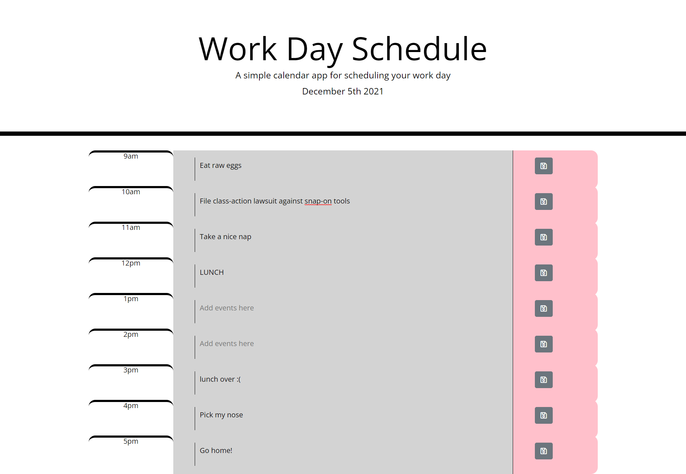

# Reminder-Calender

A work day planner application.

## Overview

Built by utilizing jQuery, Bootsrap, Javascript, and Moment.js this application displays the current date and time in header and allows the user to add events and save them to easily keep track of daily tasks from 9:00am to 5:00pm. Timeblocks in grey represent the past hour of the day, timeblocks in red represent the current hour of the day, and timeblocks in green represent the future. 

## Preveiw 
GitHub Pages: https://kasaipreston.github.io/Day-planner/

GitHub Repository: https://github.com/kasaipreston/Day-planner

## Credit

- Third-party api used: Moment.js https://momentjs.com/ 

- CSS framework: Bootsrap  https://getbootstrap.com/

- Icons from: https://fontawesome.com/v5.15/how-to-use/customizing-wordpress/snippets/setup-kit

- UI: https://jqueryui.com/

